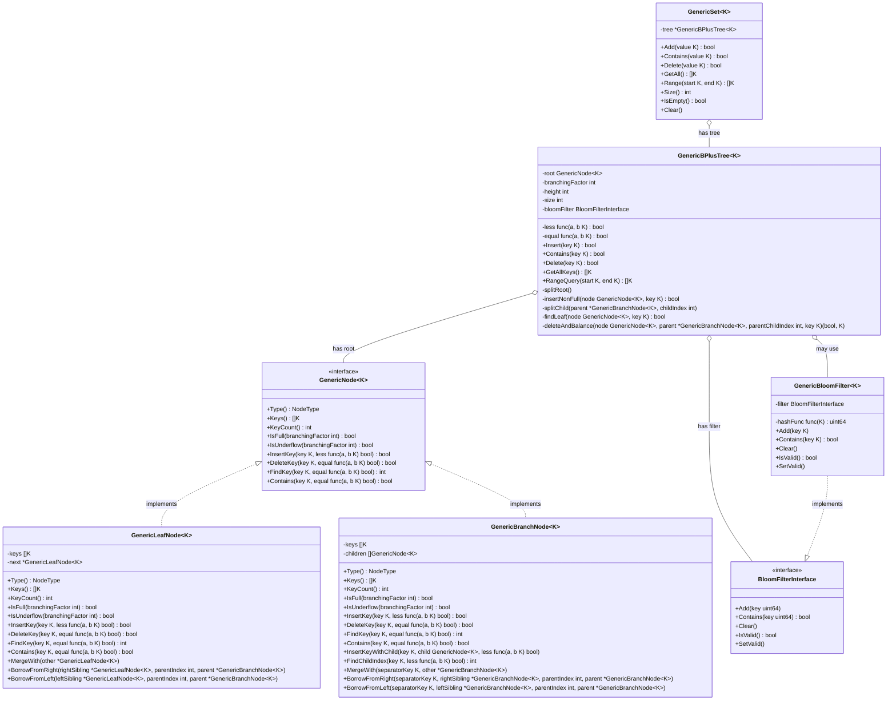

# Generic B+ Tree Component Diagram



## Key Relationships

1. **GenericNode Interface**: The core interface that both leaf and branch nodes implement.

2. **Node Implementations**:

   - `GenericLeafNode`: Stores the actual keys and implements the GenericNode interface.
   - `GenericBranchNode`: Stores keys and pointers to child nodes and implements the GenericNode interface.

3. **Tree Structure**:

   - `GenericBPlusTree`: Contains the root node and operations for manipulating the tree.
   - The root can be either a leaf or branch node, depending on the tree's height.

4. **Bloom Filter Integration**:

   - `GenericBloomFilter`: A generic wrapper around the BloomFilterInterface that can work with any key type.
   - The B+ tree uses the bloom filter to optimize Contains operations.

5. **Set Abstraction**:
   - `GenericSet`: A high-level abstraction that uses the B+ tree to implement a set data structure.
   - Provides a simpler API for common set operations.

## Data Flow

1. **Insertion**:

   ```
   GenericSet.Add(key) → GenericBPlusTree.Insert(key) →
   [find leaf node] → GenericLeafNode.InsertKey(key) →
   [if node is full] → GenericBPlusTree.splitChild() →
   [update bloom filter]
   ```

2. **Lookup**:

   ```
   GenericSet.Contains(key) → GenericBPlusTree.Contains(key) →
   [check bloom filter] → [if might contain] →
   [find leaf node] → GenericLeafNode.Contains(key)
   ```

3. **Deletion**:

   ```
   GenericSet.Delete(key) → GenericBPlusTree.Delete(key) →
   [find leaf node] → GenericLeafNode.DeleteKey(key) →
   [if underflow] → [rebalance tree] →
   [update bloom filter]
   ```

4. **Range Query** (new functionality):
   ```
   GenericSet.Range(start, end) → GenericBPlusTree.RangeQuery(start, end) →
   [find start leaf] → [traverse linked list of leaves until end] →
   [collect keys in range]
   ```
