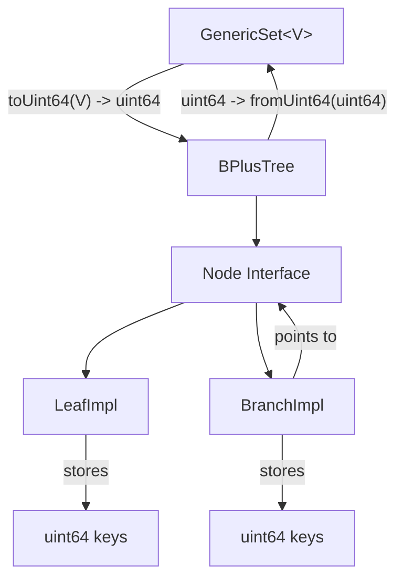

# Comparison: Current vs. Generic B+ Tree Implementation

## Current Implementation

The current implementation uses a B+ tree that only works with uint64 keys, with the GenericSet using conversion functions to map between generic types and uint64.



### Pros

- **Simplicity**: Only one B+ tree implementation is needed
- **Memory Efficiency**: uint64 keys have a fixed size
- **Implementation Ease**: No need for generic programming complexities

### Cons

- **Type Conversion Overhead**: Converting between types adds performance overhead
- **Loss of Type Information**: Conversion can lose information (especially for strings)
- **Limited Functionality**: Operations like range queries are difficult to implement correctly
- **Type Safety Issues**: No compile-time type checking for the actual keys stored in the tree

## Proposed Generic Implementation

The proposed implementation makes the B+ tree itself generic, parameterized by the key type.

```mermaid
flowchart TD
    A[GenericSet&lt;K&gt;] --> B[GenericBPlusTree&lt;K&gt;]
    B --> C[GenericNode&lt;K&gt; Interface]
    C --> D[GenericLeafNode&lt;K&gt;]
    C --> E[GenericBranchNode&lt;K&gt;]
    D -->|stores| F[K keys]
    E -->|stores| G[K keys]
    E -->|points to| C
    B -->|uses| H[less(a, b K) bool]
    B -->|uses| I[equal(a, b K) bool]
```

### Pros

- **Type Safety**: Compile-time type checking for keys
- **Performance**: No conversion overhead
- **Functionality**: Natural implementation of operations like range queries
- **Maintainability**: Cleaner code without conversion functions
- **Flexibility**: Works with any type that supports comparison

### Cons

- **Implementation Complexity**: More complex generic programming
- **Code Size**: More code due to generic implementations
- **Memory Usage**: Variable-sized keys may use more memory
- **Bloom Filter Integration**: More complex with generic keys

## Performance Comparison

| Operation   | Current Implementation    | Generic Implementation |
| ----------- | ------------------------- | ---------------------- |
| Insert      | O(log n) + conversion     | O(log n)               |
| Lookup      | O(log n) + conversion     | O(log n)               |
| Delete      | O(log n) + conversion     | O(log n)               |
| Range Query | O(m + log n) + conversion | O(m + log n)           |

Where:

- n is the number of keys in the tree
- m is the number of keys in the range

The generic implementation eliminates the conversion overhead, which can be significant for complex types or large datasets.

## Memory Usage Comparison

| Key Type | Current Implementation           | Generic Implementation |
| -------- | -------------------------------- | ---------------------- |
| uint64   | 8 bytes per key                  | 8 bytes per key        |
| int      | 8 bytes per key                  | 8 bytes per key        |
| string   | 8 bytes per key + string storage | 16+ bytes per key      |
| struct   | 8 bytes per key + struct storage | 16+ bytes per key      |

The generic implementation may use more memory for complex types, but it avoids the need to store both the original value and its uint64 representation.

## Code Complexity Comparison

| Aspect          | Current Implementation | Generic Implementation |
| --------------- | ---------------------- | ---------------------- |
| Lines of Code   | Less                   | More                   |
| Type Safety     | Lower                  | Higher                 |
| Maintainability | Lower                  | Higher                 |
| Extensibility   | Lower                  | Higher                 |

The generic implementation requires more code initially but is more maintainable and extensible in the long run.

## Use Case Suitability

| Use Case                          | Current Implementation          | Generic Implementation |
| --------------------------------- | ------------------------------- | ---------------------- |
| Simple key types (int, uint64)    | ✅ Good                         | ✅ Good                |
| String keys                       | ⚠️ Limited (hash collisions)    | ✅ Good                |
| Custom struct keys                | ⚠️ Limited (complex conversion) | ✅ Good                |
| Range queries                     | ⚠️ Limited                      | ✅ Good                |
| Large datasets                    | ✅ Good (memory efficient)      | ⚠️ Depends on key type |
| Performance-critical applications | ⚠️ Conversion overhead          | ✅ Good                |

## Implementation Effort

| Task                   | Current Implementation             | Generic Implementation |
| ---------------------- | ---------------------------------- | ---------------------- |
| Initial Implementation | ✅ Already done                    | ❌ Needs to be done    |
| Maintenance            | ⚠️ More complex due to conversions | ✅ Simpler             |
| Adding new features    | ⚠️ More difficult                  | ✅ Easier              |
| Testing                | ✅ Already done                    | ❌ Needs to be done    |

## Conclusion

The generic implementation offers significant advantages in terms of type safety, performance, and functionality, especially for complex key types and operations like range queries. While it requires more initial implementation effort, it will be more maintainable and extensible in the long run.

The current implementation may still be preferable for simple use cases with basic key types where the conversion overhead is minimal, but for a robust, general-purpose B+ tree, the generic implementation is clearly superior.
